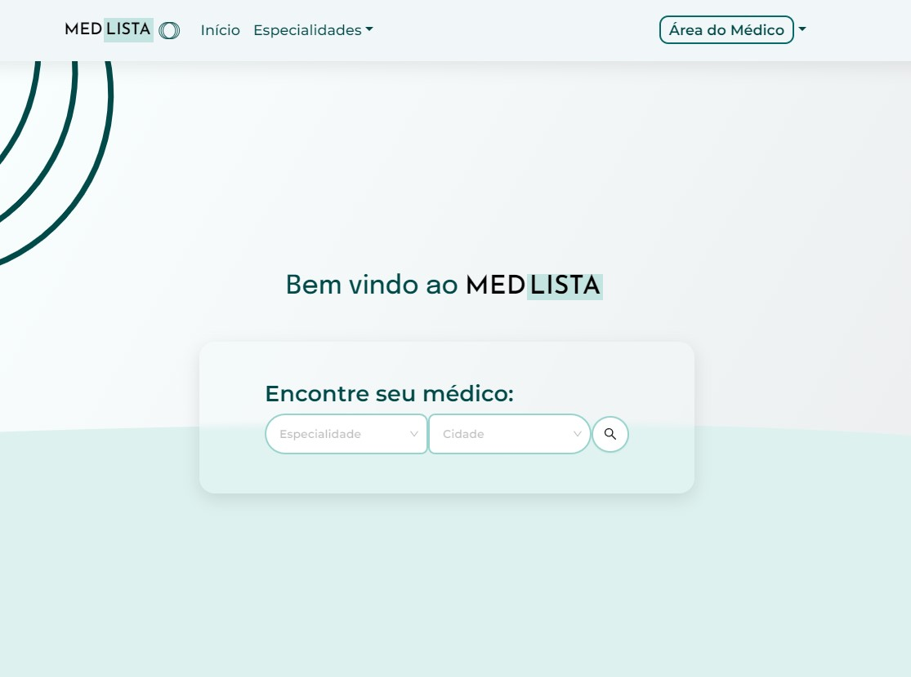

# Med-Lista

Bem-vindo ao repositório do **Med-Lista**, a sua plataforma de busca médica abrangendo todas as especialidades. Desenvolvido com React para o frontend, Firebase como banco de dados e Node.js para o backend, o Med-Lista oferece uma experiência de usuário fluida e eficiente para encontrar profissionais de saúde em diversas especialidades.

Visite [Med-Lista](www.med-lista.com) para explorar a plataforma.

## Preview do Projeto

# Aviso Importante

Este repositório **não contém o código-fonte** do projeto devido à presença de dados sensíveis e chaves de API que, se expostas, poderiam comprometer a segurança e privacidade de nossos usuários. Caso necessite de provas de desenvolvimento ou tenha questões específicas, por favor, entre em contato através do [LinkedIn de Matheus Bomtempo](https://www.linkedin.com/in/matheus-bomtempo-9b605712a/).

## Sobre o Projeto

Med-Lista visa simplificar a busca por profissionais médicos, oferecendo uma plataforma fácil de navegar, onde usuários podem encontrar médicos de todas as especialidades em sua região, ver detalhes sobre os profissionais e entrar em contato direto.

### Funcionalidades

- **Busca Personalizada:** Encontre médicos por especialidade, localização e avaliações.
- **Perfis Detalhados:** Acesse informações detalhadas sobre os profissionais, incluindo experiência, qualificações e avaliações de outros pacientes.
- **Interface Amigável:** Uma plataforma fácil de usar, projetada para oferecer a melhor experiência ao usuário.

## Tecnologias Utilizadas

- **React.js:** Para uma interface de usuário interativa.
- **Firebase:** Para armazenamento de dados e autenticação.
- **Node.js:** Para a lógica de servidor e integrações de API.
- Design criado no **Figma** por Matheus Bomtempo.

Visite [Med-Lista](www.med-lista.com) para explorar a plataforma.

## Como Contribuir

Interessado em contribuir para o Med-Lista? Embora o código-fonte não esteja disponível publicamente por motivos de segurança, valorizamos suas ideias e feedback. Entre em contato conosco via [LinkedIn](https://www.linkedin.com/in/matheus-bomtempo-9b605712a/) para discutir como você pode contribuir.

## Licença

Este projeto está sob uma licença MIT.

---

Desenvolvido por Matheus Bomtempo e Thaian ramalho..
