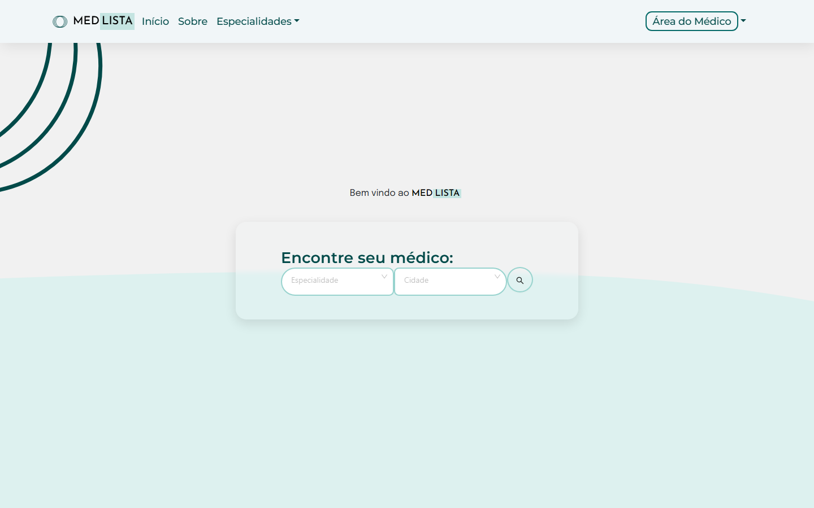

<div align="center">

<h1>MED LISTA</h1>

<p><strong>Find the right doctor, compare, and review — all in one place.</strong></p>

<p>
  A doctor-discovery platform for Brazil: search by specialty, city, health insurance and rating,
  read verified patient reviews, and let physicians manage their own public profile.
</p>

<p>
  <a href="https://med-lista.com"><strong>Live site</strong></a> ·
  <a href="#features">Features</a> ·
  <a href="#getting-started">Getting started</a> ·
  <a href="#architecture">Architecture</a>
</p>

<p>
  
  
  
  
  
</p>



</div>

---

## Overview

**Med Lista** connects patients with physicians. Patients search the directory, filter by what
matters to them and read honest reviews. Doctors register, get their **CRM** (Brazilian medical
council registration) validated automatically, and follow how their profile performs. Admins keep
the catalog trustworthy by approving profiles and moderating comments.

> The interface is in Brazilian Portuguese, since the platform serves Brazilian patients.

## Features

### For patients
- **Smart search** by specialty, city, health insurance (*convênio*), minimum rating or doctor name
- **Rich doctor profiles** with specialty, CRM, location, accepted insurance plans and contact links
- **Reviews and ratings** to help others choose, with phone (SMS) verification to curb fake reviews
- **Floating WhatsApp button** for quick support

### For doctors
- **Guided registration** and profile editing, including profile photo upload
- **Automatic CRM validation** against the national medical council registry
- **Dashboard** with profile views over time, ratings and link-click statistics (Instagram, Lattes)

### For admins
- **Profile approval** queue (single or bulk) before a profile goes public
- **Comment moderation**
- **Catalog management** for specialties, health insurance plans and admin users, plus global settings

### Under the hood
- Email/password and Google sign-in, with **private** and **admin-only** route guards
- **reCAPTCHA** on login and sign-up
- Lazy-loaded routes, images and backgrounds for fast first paint
- Error boundaries and a friendly 404 page

## Tech stack

| Layer | Technology |
| --- | --- |
| UI | React 18, React Router 6, Ant Design 5, React-Bootstrap, Tailwind CSS, Font Awesome |
| Charts | Recharts |
| Backend as a service | Firebase Authentication, Cloud Firestore, Cloud Storage |
| Serverless | Netlify Functions (CRM validation through the Infosimples API) |
| Tooling | Create React App, Docker |

## Architecture

```text
┌──────────────┐        ┌────────────────────────┐
│   Browser    │───────▶│  Firebase              │
│  React SPA   │        │  Auth · Firestore ·    │
│              │        │  Storage               │
└──────┬───────┘        └────────────────────────┘
       │ POST /.netlify/functions/validarCRM
       ▼
┌────────────────────────┐        ┌────────────────────┐
│  Netlify Function      │───────▶│  Infosimples API   │
│  (holds the API token) │        │  CFM CRM lookup    │
└────────────────────────┘        └────────────────────┘
```

The Infosimples token **never reaches the browser**: it lives only in the serverless function's
environment.

### Project structure

```text
.
├── netlify/functions/      # Serverless CRM validation
├── public/                 # HTML shell, manifest, redirects
└── src/
    ├── componentes/        # Reusable UI (Navbar, Footer, Rating, Comments, ...)
    ├── contexts/           # AuthContext and route guards (private / admin)
    ├── pages/              # Home, Pesquisa, PerfilMed, Avalia, Dashboard, Admin, ...
    ├── utils/              # CRM validation hook, specialty list, admin helper
    └── firebase.js         # Firebase initialization (env-driven)
```

## Getting started

### Prerequisites

- [Node.js](https://nodejs.org/) 16 or newer and npm
- A [Firebase](https://console.firebase.google.com/) project with **Authentication**
  (Email/Password, Google, Phone), **Firestore** and **Storage** enabled
- A Google [reCAPTCHA v2](https://www.google.com/recaptcha/admin) site key
- An [Infosimples](https://infosimples.com/) API token (only needed for CRM validation)
- [Netlify CLI](https://docs.netlify.com/cli/get-started/) to run the serverless function locally

### Installation

```bash
git clone https://github.com/MatheusBomtempo/Med-lista.git
cd Med-lista
npm install
```

### Configuration

Copy the example file and fill in your own values:

```bash
cp .env.example .env
```

| Variable | Scope | Description |
| --- | --- | --- |
| `REACT_APP_FIREBASE_*` | Browser | Firebase web app configuration (API key, auth domain, project id, bucket, sender id, app id, measurement id) |
| `REACT_APP_RECAPTCHA_SITE_KEY` | Browser | reCAPTCHA **site** key (public) |
| `REACT_APP_WHATSAPP_NUMBER` | Browser | Number used by the floating WhatsApp button |
| `INFOSIMPLES_TOKEN` | Server | Infosimples API token, read only by the Netlify function |
| `INFOSIMPLES_API_URL` | Server | Optional override of the Infosimples endpoint |

> `.env` files are git-ignored. Never commit real credentials, and never put the reCAPTCHA
> *secret* key or the Infosimples token in a `REACT_APP_*` variable: those are bundled into the
> frontend.

### Run locally

With the serverless function (recommended, enables CRM validation):

```bash
npx netlify dev
```

Or just the frontend:

```bash
npm start
```

The app is served at <http://localhost:3000> (or the port printed by Netlify CLI). Restart the
server after changing `.env`.

See [`CONFIGURAR_TOKEN_DEV.md`](CONFIGURAR_TOKEN_DEV.md) and [`NETLIFY_SETUP.md`](NETLIFY_SETUP.md)
for step-by-step guides (in Portuguese).

### Granting admin access

Sign up normally, then promote the account by setting `role: "admin"` on its document in the
Firestore `users` collection. The helper in
[`src/utils/adicionarAdmin.js`](src/utils/adicionarAdmin.js) does exactly that for a given UID.

## Scripts

| Command | Description |
| --- | --- |
| `npm start` | Start the development server |
| `npm run build` | Create an optimized production build in `build/` |
| `npm test` | Run the test runner in watch mode |

## Deployment

The project is configured for **Netlify** ([`netlify.toml`](netlify.toml)): the build publishes
`build/`, functions live in `netlify/functions`, and every route falls back to `index.html` for
client-side routing. Add the environment variables from the table above in
**Site settings → Environment variables**.

A [`Dockerfile`](Dockerfile) is also provided to build and serve the app in a container:

```bash
docker build -t med-lista .
docker run -p 3000:3000 --env-file .env med-lista
```

## Security

- Credentials are injected through environment variables; none are stored in the repository or its
  git history.
- The only key present in the source is the reCAPTCHA **site** key, which is public by design.
- Firestore and Storage access must be protected with proper
  [security rules](https://firebase.google.com/docs/rules) in your Firebase project: client-side
  route guards alone are not an authorization layer.

Found a vulnerability? Please open a private security advisory instead of a public issue.

## Contributing

Contributions are welcome!

1. Fork the repository and create a branch: `git checkout -b feat/my-feature`
2. Commit using [Conventional Commits](https://www.conventionalcommits.org/): `feat: add ...`
3. Push and open a pull request describing the change

## License

Distributed under the MIT License. See [`LICENSE`](LICENSE) for details.

## Author

**Matheus Bomtempo**

- GitHub: [@MatheusBomtempo](https://github.com/MatheusBomtempo)
- LinkedIn: [Matheus Bomtempo](https://www.linkedin.com/in/matheus-bomtempo-9b605712a/)

<div align="center">

If you find this project useful, consider giving it a star!

</div>
